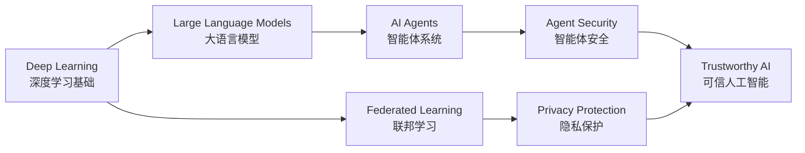

<div align="center">


### 👋 你好，我是一名人工智能专业硕士研究生

专注于 **深度学习 · 智能体安全 · 隐私保护**<br/>
探索更智能、更安全、更值得信赖的人工智能系统

[](https://github.com/yu123-ops)
[](https://github.com/yu123-ops?tab=followers)

</div>

## 👨‍🎓 About Me

```text
🎓  211 高校 · 人工智能专业硕士研究生在读
🔬  研究方向 · 深度学习 / 智能体安全 / 隐私保护
🧠  长期关注 · 大语言模型、可信人工智能与隐私计算
🌱  持续学习 · 用研究理解问题，用代码验证想法
🎯  研究愿景 · Build intelligent systems and make them trustworthy.
```

我对人工智能系统在真实环境中的**安全性、可靠性与隐私性**尤为感兴趣。目前围绕深度学习和智能体技术持续学习与实践，希望将算法研究、工程实现和安全思维结合起来，探索可信人工智能的更多可能。

## 🔬 Research Interests

<table>
  <tr>
    <td width="33%" align="center">
      <h3>🧠 深度学习</h3>
      <p>Deep Learning</p>
      <p>神经网络 · 表示学习<br/>模型训练 · 优化方法</p>
    </td>
    <td width="33%" align="center">
      <h3>🛡️ 智能体安全</h3>
      <p>AI Agent Security</p>
      <p>提示注入 · 越狱防御<br/>智能体可信与安全</p>
    </td>
    <td width="33%" align="center">
      <h3>🔐 隐私保护</h3>
      <p>Privacy-Preserving AI</p>
      <p>联邦学习 · 差分隐私<br/>隐私保护机器学习</p>
    </td>
  </tr>
</table>

## 🛠️ Tech Stack

### Languages


### AI & Machine Learning


### Development Tools


## 🚀 Current Focus

- 🤖 学习大语言模型与 AI Agent 的核心方法和应用框架
- 🛡️ 探索提示注入、越狱攻击及智能体安全防御机制
- 🔏 研究联邦学习、差分隐私等隐私保护技术
- 📖 阅读并复现深度学习与可信人工智能领域的优秀工作
- 💻 将研究想法沉淀为可复现、可维护的开源项目

## 🗺️ Research Roadmap



## 📊 GitHub Activity

<div align="center">


<br/>


</div>

## 💬 A Little More

```python
class AIResearcher:
    def __init__(self):
        self.identity = "AI Graduate Student"
        self.interests = [
            "Deep Learning",
            "AI Agent Security",
            "Privacy-Preserving AI",
        ]

    def mission(self):
        return "Make AI smarter, safer, and more trustworthy."
```

<div align="center">

### ✨ 保持好奇，持续学习，让每一次提交都有意义。

*Stay curious. Keep building. Make AI trustworthy.*


</div>
