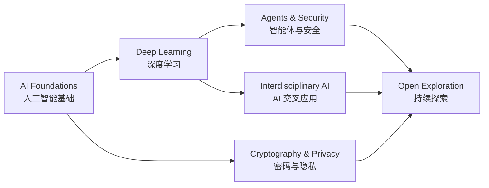

<div align="center">


### 👋 你好，我是一名人工智能专业硕士研究生

关注 **深度学习 · 人工智能安全 · 隐私保护 · AI 交叉应用**<br/>
以开放的视角探索人工智能、安全技术与不同学科的结合

[](https://github.com/yu123-ops)
[](https://github.com/yu123-ops?tab=followers)

</div>

## 👨‍🎓 About Me

```text
🎓  211 高校 · 人工智能专业硕士研究生在读
🔬  当前方向 · 深度学习 / 智能体安全 / 隐私保护
🔐  知识背景 · 密码学与信息安全
🩺  未来探索 · AI for Science / AI + 医学等交叉应用
🌱  学习方式 · 用研究理解问题，用代码验证想法
🎯  长期目标 · 探索有价值、可信赖的人工智能技术
```

我拥有人工智能专业背景，并学习过密码学与信息安全相关知识。目前主要关注深度学习、智能体安全和隐私保护，同时对人工智能在医学等领域的交叉应用保持兴趣。相比限定在单一方向，我更希望把算法研究、工程实践和安全思维结合起来，持续探索真正有价值的 AI 问题。

## 🔬 Research Interests

<table>
  <tr>
    <td width="25%" align="center">
      <h3>🧠 深度学习</h3>
      <p>Deep Learning</p>
      <p>神经网络 · 表示学习<br/>模型训练 · 优化方法</p>
    </td>
    <td width="25%" align="center">
      <h3>🛡️ AI 安全</h3>
      <p>AI Security</p>
      <p>智能体安全 · 模型安全<br/>可信与可靠人工智能</p>
    </td>
    <td width="25%" align="center">
      <h3>🔐 密码与隐私</h3>
      <p>Cryptography & Privacy</p>
      <p>密码学 · 隐私计算<br/>隐私保护机器学习</p>
    </td>
    <td width="25%" align="center">
      <h3>🩺 AI 交叉应用</h3>
      <p>Interdisciplinary AI</p>
      <p>AI for Science<br/>AI + 医学等领域</p>
    </td>
  </tr>
</table>

## 🛠️ Tech Stack

### Languages


### AI & Machine Learning


### Development Tools


## 🚀 Current Focus

- 🤖 学习大语言模型与 AI Agent 的核心方法和应用框架
- 🛡️ 探索提示注入、越狱攻击及智能体安全防御机制
- 🔏 结合密码学基础，理解隐私计算与数据安全问题
- 🩺 关注人工智能在医学健康等交叉领域的应用潜力
- 📖 阅读并复现深度学习与可信人工智能领域的优秀工作
- 💻 持续拓展技术边界，将研究想法沉淀为可复现的实践

## 🗺️ Research Roadmap



<div align="center">

### ✨ 保持好奇，持续学习，让每一次提交都有意义。

*Stay curious. Keep learning. Explore beyond boundaries.*


</div>
